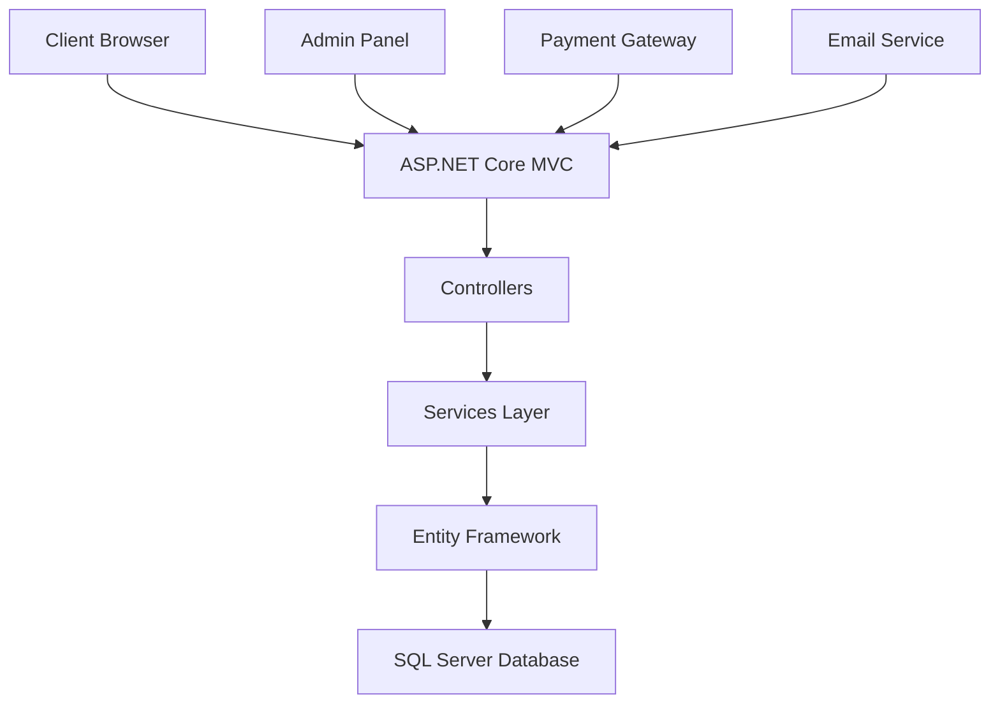
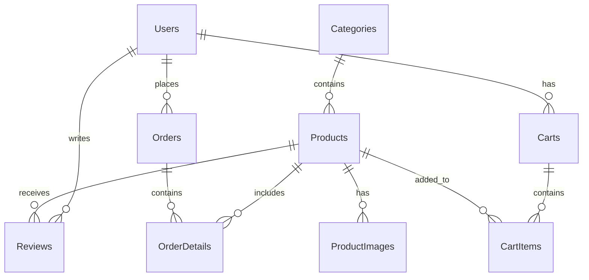

<div align="center">

# 🛍️ Shop Technology Accessories

### 🚀 Website Thương Mại Điện Tử Chuyên Bán Phụ Kiện Công Nghệ

[](https://dotnet.microsoft.com/)
[](https://dotnet.microsoft.com/apps/aspnet)
[](https://docs.microsoft.com/en-us/ef/)
[](https://www.microsoft.com/en-us/sql-server/)
[](https://getbootstrap.com/)

[](https://opensource.org/licenses/MIT)
[](https://github.com/your-username/shop-technology-accessories)
[](https://github.com/your-username/shop-technology-accessories/releases)

---

### 📱 Demo Website
**🌐 Live Demo:** [https://shoptech-demo.azurewebsites.net](https://shoptech-demo.azurewebsites.net)

### 🎯 Features Preview


</div>

---

## 📋 Table of Contents

- [🎯 Overview](#-overview)
- [✨ Features](#-features)
- [🛠️ Tech Stack](#️-tech-stack)
- [🏗️ Architecture](#️-architecture)
- [🚀 Quick Start](#-quick-start)
- [📦 Installation](#-installation)
- [🔧 Configuration](#-configuration)
- [📊 Database Schema](#-database-schema)
- [🎨 Screenshots](#-screenshots)
- [🤝 Contributing](#-contributing)
- [📄 License](#-license)

---

## 🎯 Overview

<div align="center">


**Modern E-commerce Platform for Technology Accessories**

> 🎉 **Built with cutting-edge technologies and modern design patterns**

</div>

### 🌟 Key Highlights

- 🛒 **Full-featured E-commerce Solution**
- 🔐 **Secure Authentication & Authorization**
- 📱 **Responsive Design (Mobile-First)**
- ⚡ **High Performance & Scalable**
- 🎨 **Modern UI/UX Design**
- 🔍 **Advanced Search & Filtering**
- 💳 **Multiple Payment Methods**
- 📊 **Admin Dashboard & Analytics**

---

## ✨ Features

### 🛍️ **Core E-commerce Features**

| Feature | Description | Status |
|---------|-------------|--------|
| 🏠 **Homepage** | Featured products, banners, promotions | ✅ Complete |
| 🔍 **Advanced Search** | Multi-criteria search with filters | ✅ Complete |
| 📂 **Product Categories** | Organized product catalog | ✅ Complete |
| 📱 **Product Details** | Rich product information & images | ✅ Complete |
| 🛒 **Shopping Cart** | Add, remove, update quantities | ✅ Complete |
| 💳 **Checkout Process** | Multi-step checkout with validation | ✅ Complete |
| 🔐 **User Authentication** | Register, login, password reset | ✅ Complete |
| ⭐ **Product Reviews** | Rating and review system | ✅ Complete |

### 🎯 **Advanced Features**

| Feature | Description | Status |
|---------|-------------|--------|
| 🎁 **Promotion System** | Coupons, discounts, special offers | ✅ Complete |
| ❤️ **Wishlist** | Save favorite products | ✅ Complete |
| 📊 **Order Management** | Track orders, order history | ✅ Complete |
| 👤 **User Profiles** | Personal information management | ✅ Complete |
| 📧 **Email Notifications** | Order confirmations, updates | ✅ Complete |
| 🔍 **Product Comparison** | Compare multiple products | 🚧 In Progress |
| 📱 **Mobile App** | Native mobile application | 📋 Planned |

### 🔧 **Admin Features**

| Feature | Description | Status |
|---------|-------------|--------|
| 📊 **Dashboard** | Sales analytics, statistics | ✅ Complete |
| 📦 **Product Management** | CRUD operations for products | ✅ Complete |
| 📋 **Order Management** | Process and track orders | ✅ Complete |
| 👥 **User Management** | Customer account management | ✅ Complete |
| 🎨 **Content Management** | Banners, promotions, FAQs | ✅ Complete |
| 🔐 **Role-based Access** | Admin, staff, customer roles | ✅ Complete |

---

## 🛠️ Tech Stack

### 🎯 **Backend Technologies**

<div align="center">


</div>

### 🎨 **Frontend Technologies**

<div align="center">


</div>

### 🗄️ **Database & Storage**

<div align="center">


</div>

### 🔧 **Development Tools**

<div align="center">


</div>

---

## 🏗️ Architecture

### 📁 **Project Structure**

```
ShopTechnology/
├── 📁 Controllers/          # 🎮 MVC Controllers
│   ├── HomeController.cs
│   ├── ProductController.cs
│   ├── CartController.cs
│   ├── OrderController.cs
│   └── AccountController.cs
├── 📁 Models/              # 🗃️ Entity Models
│   ├── Product.cs
│   ├── Category.cs
│   ├── User.cs
│   ├── Order.cs
│   └── HomeViewModel.cs
├── 📁 Services/            # ⚙️ Business Logic
│   ├── IProductService.cs
│   ├── ProductService.cs
│   ├── ICartService.cs
│   ├── CartService.cs
│   └── [Other Services]
├── 📁 ViewModels/          # 📋 View Models
│   ├── CartViewModel.cs
│   ├── ProductViewModel.cs
│   └── AccountViewModels.cs
├── 📁 Views/               # 🎨 Razor Views
│   ├── Home/
│   ├── Product/
│   ├── Cart/
│   └── Account/
├── 📁 wwwroot/             # 🌐 Static Files
│   ├── css/
│   ├── js/
│   └── images/
├── 📁 Areas/               # 🏢 Admin Area
│   └── Admin/
├── 📁 Middleware/          # 🔧 Custom Middleware
└── 📁 DTOs/                # 📦 Data Transfer Objects
```

### 🔄 **Architecture Pattern**

<div align="center">



</div>

---

## 🚀 Quick Start

### ⚡ **Prerequisites**

<div align="center">


</div>

### 📋 **System Requirements**

- **OS**: Windows 10/11, macOS, Linux
- **.NET**: 8.0 SDK or later
- **Database**: SQL Server 2019 or later
- **IDE**: Visual Studio 2022 or VS Code
- **Memory**: 4GB RAM minimum
- **Storage**: 2GB free space

---

## 📦 Installation

### 🔧 **Step 1: Clone Repository**

```bash
# Clone the repository
git clone https://github.com/your-username/shop-technology-accessories.git

# Navigate to project directory
cd shop-technology-accessories/ShopTechnology

# Install dependencies
dotnet restore
```

### 🗄️ **Step 2: Database Setup**

#### Option A: Automatic Setup (Recommended)
```bash
# Run the database setup script
setup-database.bat
```

This will:
- Start LocalDB if not running
- Create the database with all tables
- Insert sample data (categories, products, users)
- Create indexes and stored procedures

#### Option B: Manual Setup
```bash
# Update connection string in appsettings.json
# Then run migrations
dotnet ef database update

# Or run the SQL script manually
# Execute: db/Demo1_ShopTechnologyAccessories.sql
```

### ⚙️ **Step 3: Configuration**

```json
// appsettings.json
{
  "ConnectionStrings": {
    "DefaultConnection": "Data Source=YOUR_SERVER;Database=ShopTechnologyAccessories;User Id=sa;Password=YOUR_PASSWORD;TrustServerCertificate=true;"
  },
  "Email": {
    "SmtpHost": "smtp.gmail.com",
    "SmtpPort": 587,
    "Username": "your-email@gmail.com",
    "Password": "your-app-password"
  }
}
```

### 🚀 **Step 4: Run Application**

```bash
# Build the project
dotnet build

# Run the application
dotnet run

# Or use Visual Studio
# Press F5 or Ctrl+F5
```

### 🌐 **Step 5: Access Application**

<div align="center">

| Environment | URL | Description |
|-------------|-----|-------------|
| 🏠 **Development** | `https://localhost:7000` | Local development |
| 🧪 **Testing** | `https://localhost:5000` | Alternative port |
| 👤 **Admin Panel** | `https://localhost:7000/Admin` | Admin dashboard |

</div>

### 🔑 **Default Credentials**

| Role | Email | Password |
|------|-------|----------|
| 👑 **Admin** | `admin@shoptech.com` | `admin123` |
| 👤 **Customer** | `customer@shoptech.com` | `customer123` |
| 👤 **Demo User** | `donhotung2004@gmail.com` | `Donhotung2004` |

---

## 🔧 Configuration

### 📧 **Email Configuration**

```json
{
  "Email": {
    "FromEmail": "noreply@shoptech.com",
    "FromName": "Shop Technology",
    "Smtp": {
      "Host": "smtp.gmail.com",
      "Port": 587,
      "Username": "your-email@gmail.com",
      "Password": "your-app-password",
      "EnableSsl": true
    }
  }
}
```

### 🔐 **Authentication Settings**

```json
{
  "Jwt": {
    "Key": "YourSuperSecretKey123!@#$%^&*()",
    "Issuer": "ShopTechnologyAccessories",
    "Audience": "ShopTechnologyAccessoriesUsers"
  }
}
```

### 💳 **Payment Configuration**

```json
{
  "Payment": {
    "Stripe": {
      "PublishableKey": "pk_test_your_key",
      "SecretKey": "sk_test_your_key"
    },
    "PayPal": {
      "ClientId": "your_client_id",
      "ClientSecret": "your_client_secret"
    }
  }
}
```

---

## 📊 Database Schema

### 🗃️ **Core Tables**

<div align="center">

| Table | Description | Records |
|-------|-------------|---------|
| 📦 **Products** | Product catalog | 100+ |
| 📂 **Categories** | Product categories | 10+ |
| 👥 **Users** | Customer accounts | 1000+ |
| 🛒 **Orders** | Order information | 500+ |
| 📋 **OrderDetails** | Order line items | 2000+ |
| 🛍️ **Carts** | Shopping carts | 500+ |
| ⭐ **Reviews** | Product reviews | 300+ |

</div>

### 🔗 **Entity Relationships**



---

## 🎨 Screenshots

<div align="center">

### 🏠 **Homepage**


### 📱 **Product Details**


### 🛒 **Shopping Cart**


### 📊 **Admin Dashboard**


</div>

---

## 🤝 Contributing

<div align="center">


**We welcome contributions! Please feel free to submit a Pull Request.**

</div>

### 📋 **How to Contribute**

1. 🍴 **Fork the repository**
2. 🌿 **Create a feature branch** (`git checkout -b feature/AmazingFeature`)
3. 💾 **Commit your changes** (`git commit -m 'Add some AmazingFeature'`)
4. 📤 **Push to the branch** (`git push origin feature/AmazingFeature`)
5. 🔀 **Open a Pull Request**

### 🐛 **Bug Reports**

If you find a bug, please create an issue with:
- 🐛 **Bug description**
- 🔄 **Steps to reproduce**
- 💻 **Expected vs actual behavior**
- 📱 **Environment details**

### 💡 **Feature Requests**

We love new ideas! Please include:
- 💡 **Feature description**
- 🎯 **Use case**
- 📋 **Acceptance criteria**

---

## 📄 License

<div align="center">


**This project is licensed under the MIT License - see the [LICENSE](LICENSE) file for details.**

</div>

---

## 📞 Support & Contact

<div align="center">

| Contact Method | Details |
|----------------|---------|
| 📧 **Email** | support@shoptech.com |
| 📱 **Phone** | +84 123-456-789 |
| 🌐 **Website** | https://shoptech.com |
| 💬 **Discord** | [Join our community](https://discord.gg/shoptech) |

</div>

---

<div align="center">

### ⭐ **Star this repository if you found it helpful!**

[](https://github.com/your-username/shop-technology-accessories/stargazers)
[](https://github.com/your-username/shop-technology-accessories/network)
[](https://github.com/your-username/shop-technology-accessories/issues)

**Made with ❤️ by the Shop Technology Team**

</div>
