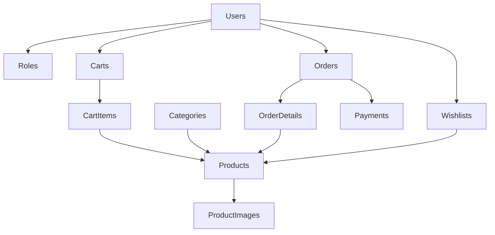

# 🚀 Shop Technology Accessories

<div align="center">


[](https://github.com/your-username/Shop-Technology-Accessories)
[](LICENSE)
[](https://github.com/your-username/Shop-Technology-Accessories/stargazers)

### 🛍️ **E-Commerce Platform for Technology Accessories**

> **Modern, scalable, and feature-rich e-commerce solution** built with ASP.NET Core MVC, providing cutting-edge technology accessories with seamless shopping experience.

[](https://shoptechnology.com)
[](https://docs.shoptechnology.com)

</div>

---

## 🎯 **Quick Start**

```bash
# 🚀 Clone & Run
git clone https://github.com/your-username/Shop-Technology-Accessories.git
cd Shop-Technology-Accessories/ShopTechnology
dotnet run
```

**✨ Access the application:**
- 🌐 **Website**: `https://localhost:5001`
- 🔧 **Admin Panel**: `https://localhost:5001/Admin`
- 📧 **Demo Account**: `admin@shop.com` / `123456`

---

## 📋 **Table of Contents**

- [🌟 Features](#-features)
- [🛠️ Technology Stack](#️-technology-stack)
- [⚡ Quick Installation](#-quick-installation)
- [🏗️ Project Structure](#️-project-structure)
- [🗄️ Database Schema](#️-database-schema)
- [🔌 API Endpoints](#-api-endpoints)
- [📖 User Guide](#-user-guide)
- [🤝 Contributing](#-contributing)
- [📄 License](#-license)

---

## 🌟 **Features**

### 👤 **Customer Experience**

<details>
<summary><b>🔐 Authentication & Account Management</b></summary>

- ✅ **User Registration** - Create new accounts with email verification
- ✅ **Secure Login/Logout** - JWT-based authentication system
- ✅ **Profile Management** - Update personal information, shipping addresses
- ✅ **Password Security** - SHA256 hashing with salt protection

</details>

<details>
<summary><b>🛒 Shopping Experience</b></summary>

- ✅ **Product Catalog** - Browse categories with rich product details
- ✅ **Advanced Search** - Filter by name, category, price range, availability
- ✅ **Product Details** - High-quality images, descriptions, specifications
- ✅ **Real-time Stock** - Live inventory tracking and notifications

</details>

<details>
<summary><b>🛍️ Cart & Wishlist</b></summary>

- ✅ **Smart Shopping Cart** - Add, update, remove items with AJAX
- ✅ **Wishlist Management** - Save favorite products for later
- ✅ **Cart Persistence** - Items saved across sessions
- ✅ **Quantity Validation** - Stock-aware quantity controls

</details>

<details>
<summary><b>📦 Order Management</b></summary>

- ✅ **Checkout Process** - Streamlined order placement
- ✅ **Payment Integration** - COD, VNPay, PayPal support
- ✅ **Order Tracking** - Real-time status updates
- ✅ **Order History** - Complete purchase records

</details>

### 👨‍💼 **Admin Dashboard**

<details>
<summary><b>📊 Analytics & Reports</b></summary>

- ✅ **Sales Dashboard** - Revenue, orders, user statistics
- ✅ **Product Analytics** - Top-selling items, inventory reports
- ✅ **User Insights** - Customer behavior, registration trends
- ✅ **Financial Reports** - Daily, monthly, yearly revenue tracking

</details>

<details>
<summary><b>🛠️ Management Tools</b></summary>

- ✅ **Product CRUD** - Full product lifecycle management
- ✅ **Order Processing** - Status updates, shipping management
- ✅ **User Administration** - Role management, account controls
- ✅ **Category Management** - Organize product catalog

</details>

---

## 🛠️ **Technology Stack**

### 🎯 **Backend Technologies**

| Technology | Version | Purpose |
|------------|---------|---------|
|  | 8.0 | Core Framework |
|  | 8.0 | Web Framework |
|  | 8.0 | ORM |
|  | 2019+ | Database |
|  | 12.0.1 | Object Mapping |
|  | Bearer | Authentication |

### 🎨 **Frontend Technologies**

| Technology | Version | Purpose |
|------------|---------|---------|
|  | 5.3 | CSS Framework |
|  | 3.6 | JavaScript Library |
|  | 6.0 | Icons |
|  | Views | Template Engine |

### 🛠️ **Development Tools**

| Tool | Purpose |
|------|---------|
|  | IDE |
|  | Version Control |
|  | Package Manager |

---

## ⚡ **Quick Installation**

### 📋 **Prerequisites**

- [](https://dotnet.microsoft.com/download/dotnet/8.0) .NET 8.0 SDK
- [](https://www.microsoft.com/en-us/sql-server) SQL Server 2019+
- [](https://visualstudio.microsoft.com/) Visual Studio 2022 (Recommended)

### 🚀 **Installation Steps**

<details>
<summary><b>1️⃣ Clone Repository</b></summary>

```bash
# Clone the repository
git clone https://github.com/your-username/Shop-Technology-Accessories.git

# Navigate to project directory
cd Shop-Technology-Accessories/ShopTechnology
```

</details>

<details>
<summary><b>2️⃣ Database Setup</b></summary>

```sql
-- Run the database script
-- File: db/Demo1_ShopTechnologyAccessories.sql

-- Update connection string in appsettings.json
{
  "ConnectionStrings": {
    "DefaultConnection": "Server=localhost;Database=ShopTechnologyAccessories;Trusted_Connection=true;TrustServerCertificate=true;MultipleActiveResultSets=true"
  }
}
```

</details>

<details>
<summary><b>3️⃣ Install Dependencies</b></summary>

```bash
# Restore NuGet packages
dotnet restore

# Build the project
dotnet build
```

</details>

<details>
<summary><b>4️⃣ Run Application</b></summary>

```bash
# Start the application
dotnet run

# Access URLs
🌐 Website: https://localhost:5001
🔧 Admin: https://localhost:5001/Admin
```

</details>

---

## 🏗️ **Project Structure**

```
📁 ShopTechnology/
├── 🎮 Controllers/           # MVC Controllers
│   ├── 🏠 HomeController.cs
│   ├── 👤 AccountController.cs
│   ├── 📦 ProductController.cs
│   ├── 🛒 CartController.cs
│   ├── 📋 OrderController.cs
│   └── ❤️ WishlistController.cs
├── 🗃️ Models/               # Entity Models
│   ├── 👤 User.cs
│   ├── 📦 Product.cs
│   ├── 📂 Category.cs
│   ├── 🛒 Cart.cs
│   ├── 📋 Order.cs
│   └── 🗄️ ShopTechnologyAccessoriesContext.cs
├── 📋 ViewModels/           # View Models
│   ├── 🔐 LoginViewModel.cs
│   ├── 📝 RegisterViewModel.cs
│   ├── 📦 ProductViewModel.cs
│   └── 🛒 CartViewModel.cs
├── ⚙️ Services/             # Business Logic
│   ├── 📦 IProductService.cs
│   ├── 📦 ProductService.cs
│   ├── ❤️ IWishlistService.cs
│   ├── ❤️ WishlistService.cs
│   ├── 📋 IOrderService.cs
│   └── 📋 OrderService.cs
├── 🎨 Views/                # Razor Views
│   ├── 🏠 Home/
│   ├── 👤 Account/
│   ├── 📦 Product/
│   ├── 🛒 Cart/
│   ├── 📋 Order/
│   └── ❤️ Wishlist/
├── 📁 wwwroot/              # Static Files
│   ├── 🎨 css/
│   ├── ⚡ js/
│   └── 📚 lib/
└── 🏢 Areas/                # Admin Area
    └── 👨‍💼 Admin/
        ├── 🎮 Controllers/
        └── 🎨 Views/
```

---

## 🗄️ **Database Schema**

### 📊 **Core Tables**

| Table | Description | Key Features |
|-------|-------------|--------------|
| 👤 **Users** | User accounts and profiles | Authentication, roles, personal info |
| 🎭 **Roles** | User role definitions | Admin, Customer permissions |
| 📂 **Categories** | Product categorization | Hierarchical organization |
| 📦 **Products** | Product information | Name, price, stock, descriptions |
| 🖼️ **ProductImages** | Product media | Multiple images per product |
| 🛒 **Carts** | Shopping cart sessions | User-specific cart management |
| 🛍️ **CartItems** | Cart contents | Product quantities and selections |
| 📋 **Orders** | Order records | Status tracking, payment info |
| 📝 **OrderDetails** | Order line items | Product details per order |
| 💳 **Payments** | Payment transactions | Method, status, amounts |
| ❤️ **Wishlists** | User favorites | Saved product lists |

### 🔗 **Relationships**



---

## 🔌 **API Endpoints**

### 🔐 **Authentication**
```http
POST /Account/Login          # User login
POST /Account/Register       # User registration
GET  /Account/Logout         # User logout
GET  /Account/Profile        # User profile
POST /Account/UpdateProfile  # Update profile
```

### 📦 **Products**
```http
GET  /Product                # Product listing
GET  /Product/Details/{id}   # Product details
POST /Product/Search         # Search products
POST /Product/Filter         # Filter products
```

### 🛒 **Cart Operations**
```http
GET  /Cart                   # View cart
POST /Cart/AddToCart         # Add to cart
POST /Cart/UpdateQuantity    # Update quantity
POST /Cart/RemoveFromCart    # Remove item
POST /Cart/ClearCart         # Clear cart
```

### ❤️ **Wishlist**
```http
GET  /Wishlist               # View wishlist
POST /Wishlist/AddToWishlist # Add to wishlist
POST /Wishlist/RemoveFromWishlist # Remove from wishlist
```

### 📋 **Orders**
```http
GET  /Order/Checkout         # Checkout page
POST /Order/PlaceOrder       # Place order
GET  /Order/History          # Order history
GET  /Order/Details/{id}     # Order details
```

### 👨‍💼 **Admin (Area)**
```http
GET  /Admin/Dashboard        # Admin dashboard
GET  /Admin/Products         # Product management
GET  /Admin/Orders           # Order management
GET  /Admin/Users            # User management
```

---

## 📖 **User Guide**

### 👤 **For Customers**

<details>
<summary><b>🛒 How to Shop</b></summary>

1. **🔐 Create Account**
   - Click "Register" to create new account
   - Verify email and complete profile

2. **🛍️ Browse Products**
   - Explore categories and featured products
   - Use search and filters to find items
   - View detailed product information

3. **🛒 Add to Cart**
   - Select quantity and add items
   - Review cart contents
   - Update quantities as needed

4. **📦 Checkout**
   - Provide shipping address
   - Choose payment method
   - Confirm order details

5. **📋 Track Orders**
   - View order history
   - Track delivery status
   - Access order details

</details>

<details>
<summary><b>❤️ Wishlist Features</b></summary>

- **Save Favorites**: Click heart icon to save products
- **View Wishlist**: Access saved items anytime
- **Move to Cart**: Convert wishlist items to cart
- **Remove Items**: Clean up unwanted items

</details>

### 👨‍💼 **For Administrators**

<details>
<summary><b>📊 Dashboard Overview</b></summary>

- **Sales Analytics**: Revenue trends and statistics
- **Order Management**: Process and track orders
- **Inventory Control**: Monitor stock levels
- **User Management**: Manage customer accounts

</details>

<details>
<summary><b>🛠️ Management Tools</b></summary>

1. **📦 Product Management**
   - Add new products with images
   - Update product information
   - Manage inventory levels
   - Organize categories

2. **📋 Order Processing**
   - View all orders
   - Update order status
   - Process payments
   - Manage shipping

3. **👥 User Administration**
   - View user accounts
   - Manage user roles
   - Monitor user activity
   - Handle support requests

</details>

---

## 🤝 **Contributing**

We welcome contributions! Here's how you can help:

### 🚀 **Getting Started**

1. **Fork the Repository**
   ```bash
   git clone https://github.com/your-username/Shop-Technology-Accessories.git
   ```

2. **Create Feature Branch**
   ```bash
   git checkout -b feature/AmazingFeature
   ```

3. **Make Changes**
   - Follow coding standards
   - Add tests for new features
   - Update documentation

4. **Commit Changes**
   ```bash
   git commit -m 'Add some AmazingFeature'
   ```

5. **Push to Branch**
   ```bash
   git push origin feature/AmazingFeature
   ```

6. **Open Pull Request**
   - Describe your changes
   - Link related issues
   - Request reviews

### 📋 **Contribution Guidelines**

- ✅ Follow existing code style
- ✅ Add comments for complex logic
- ✅ Include unit tests
- ✅ Update documentation
- ✅ Test thoroughly before submitting

---

## 📄 **License**

This project is licensed under the MIT License - see the [LICENSE](LICENSE) file for details.

```
MIT License

Copyright (c) 2024 Shop Technology Accessories

Permission is hereby granted, free of charge, to any person obtaining a copy
of this software and associated documentation files (the "Software"), to deal
in the Software without restriction, including without limitation the rights
to use, copy, modify, merge, publish, distribute, sublicense, and/or sell
copies of the Software, and to permit persons to whom the Software is
furnished to do so, subject to the following conditions:

The above copyright notice and this permission notice shall be included in all
copies or substantial portions of the Software.

THE SOFTWARE IS PROVIDED "AS IS", WITHOUT WARRANTY OF ANY KIND, EXPRESS OR
IMPLIED, INCLUDING BUT NOT LIMITED TO THE WARRANTIES OF MERCHANTABILITY,
FITNESS FOR A PARTICULAR PURPOSE AND NONINFRINGEMENT. IN NO EVENT SHALL THE
AUTHORS OR COPYRIGHT HOLDERS BE LIABLE FOR ANY CLAIM, DAMAGES OR OTHER
LIABILITY, WHETHER IN AN ACTION OF CONTRACT, TORT OR OTHERWISE, ARISING FROM,
OUT OF OR IN CONNECTION WITH THE SOFTWARE OR THE USE OR OTHER DEALINGS IN THE
SOFTWARE.
```

---

## 📞 **Contact & Support**

<div align="center">

### 🌟 **Get in Touch**

[](mailto:donhotung2004@gmail.com)
[](tel:0931982568)
[](https://shoptechnology.com)

### 🚀 **Quick Links**

[](https://shoptechnology.com)
[](https://docs.shoptechnology.com)
[](https://github.com/your-username/Shop-Technology-Accessories/issues)

</div>

---

<div align="center">

## ⭐ **Support the Project**

If this project helps you, please give it a star! ⭐

[](https://github.com/your-username/Shop-Technology-Accessories/stargazers)
[](https://github.com/your-username/Shop-Technology-Accessories/network)
[](https://github.com/your-username/Shop-Technology-Accessories/issues)

### 🎉 **Made with ❤️ by Shop Technology Team**

[](https://dotnet.microsoft.com/)
[](https://dotnet.microsoft.com/apps/aspnet)
[](https://docs.microsoft.com/en-us/ef/)

</div>
